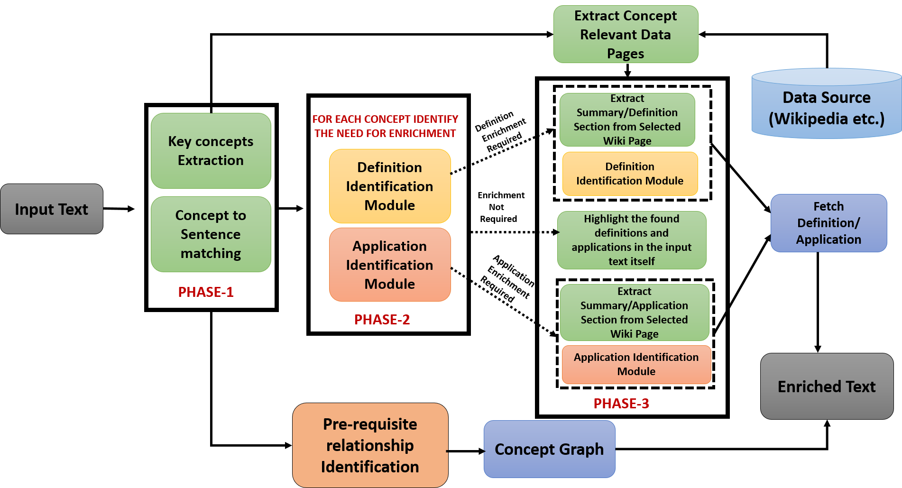
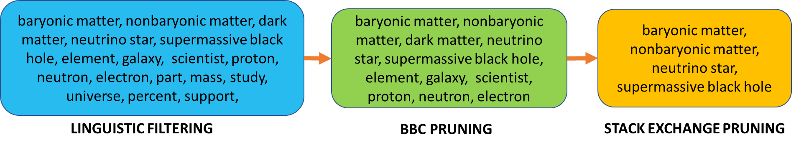
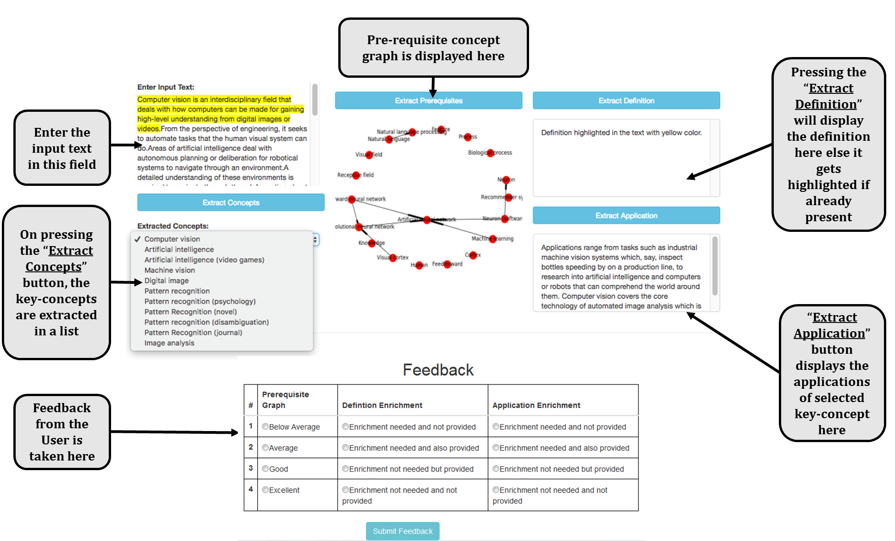

---
  # Choose a theme from https://github.com/hakimel/reveal.js#theming
  theme: black
  # Choose a code highlighting style (if highlighting enabled in `params.toml`)
  #   Light style: github. Dark style: dracula (default).
  highlight_style: dracula
---

## Content Driven Enrichment of Formal Text using Concept Definitions and Applications

Abhinav Jain, Nitin Gupta, Shashank Mujumdar, Sameep Mehta, Rishi Madhok

IBM Research India

---

## Task - Enrichment of formal text

Formal text is objective, unambiguous and composed of complexly constructed sentences intended to be understood by target demographic.

Thus, we identify the enrichment need of any formal text in terms of definitions and real-life applications of unexplained/undefined key-concepts present in the formal text.

We enrich the text with the missing information irrespective of user expertise. We further provide a concept-dependency graph that depicts inter key-concepts relationships to show a user, important key-concepts present in the text and levels of hierarchy existing amongst them.

We incorporate user expertise into our overall enrichment system with a User Interface giving users the freedom to produce responses for user-specific queries.

Following is the example of a formal text :-

“What is dark matter?”. “Dark matter may be made of baryonic or non-baryonic matter. To hold the elements of the universe together, dark matter must make up approximately 80 percent of its matter. Most scientists think that dark matter is composed of non-baryonic matter. The candidates for this are Neutralinos, massive hypothetical particles heavier and slower than neutrinos and sterile neutrinos.”

---

## Method

---

### Key-concept Extraction

- ***Linguistic Filtering*** : Extracts terminological noun phrases using pre-defined linguistic filters.
- ***BBC Pruning*** : Leverages a word-count dictionary (BBC Corpus) to prune common stop words unlikely to be key-concepts.
- ***Stack Exchange Pruning*** : To filter candidate concepts such that they pertain to technical key concepts that may occur in formal text and require enrichment (Using Stack Exchange corpus).

---

***Text Enrichment***

For enrichment with definitions and applications, we deploy our Definition and Application identification modules on key-concept’s Wikipedia page and identify and fetch those sentences which qualify as concept’s definition and application. 

***Concept Dependency Graph***
- We defined the pre-requisite structure inherent in the formal text corpus as a graph, where
  - nodes are key-concepts to comprehend,
  - a directed edge A → B corresponds to the assertion that “understanding A is a prerequisite to understanding B”
- We utilize two measures - RefDscore and Wikipedia Link Based Semantic Similarity to identify the relationship between two given key-concepts A and B

---

## Results

Note- We constructed our own system evaluation dataset consisting of (1) Lectured Notes and (2) Random Scientific Articles to validate the effectiveness of our overall enrichment system.

- For the task of key-concept identification, we evaluated our methodology and report Precision, Recall and F1 of each sub-phase when implemented sequentially in the following table – 
- With out trained CNN-LSTM network, we achieved F1 of 85.31% and 92.83% in Application and Definition Identification respectively.
- We achieved Enrichment Accuracy of 77.17% (Lectured Notes) and 78.57%(Articles) for Definition Identification and Enrichment.
- Similarly, we achieved Enrichment Accuracy of 75.14% (Lectured Notes) and 81.81%(Articles) for Application Identification and Enrichment.

---

## User-Interface

---

# Thank You

