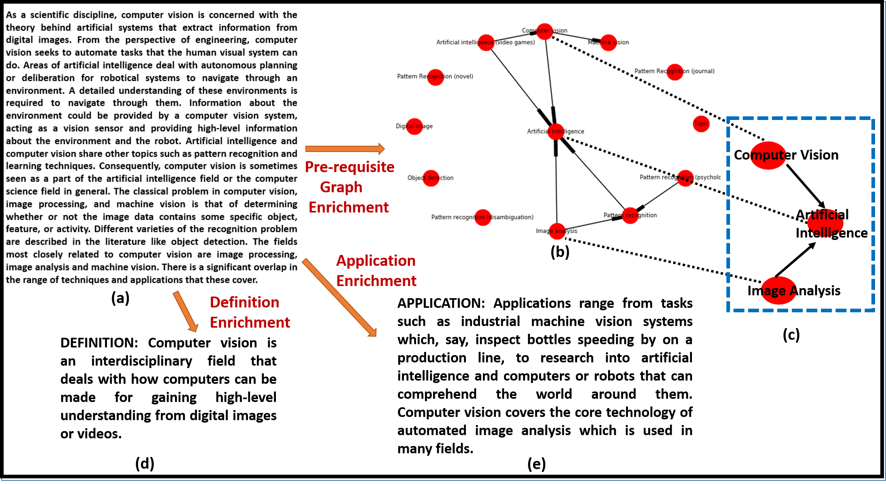

# Content Driven Enrichment of Formal Text using Concept Definitions and Applications

# Abhinav Jain, Nitin Gupta, Shashank Mujumdar, Sameep Mehta, Rishi Madhok

IBM Research India

# Task - Enrichment of formal text

Formal text is objective\, unambiguous and composed of complexly constructed sentences intended to be understood by target demographic\.

Thus\, we identify the enrichment need of any formal text in terms of definitions and real\-life applications of unexplained/undefined key\-concepts present in the formal text\.

We enrich the text with the missing information irrespective of user expertise\. We further provide a concept\-dependency graph that depicts inter key\-concepts relationships to show a user\, important key\-concepts present in the text and levels of hierarchy existing amongst them\.

We incorporate user expertise into our overall enrichment system with a User Interface giving users the freedom to produce responses for user\-specific queries\.

Following is the example of a formal text :\-

_“What is dark matter?”\. “_  _Dark_  _matter_  _may be made of_  _baryonic_  _or_  _non\-baryonic matter_  _\. To hold the elements of the universe together\, dark matter must make up_  _approximately_  _80 percent of its matter\. Most scientists think that dark matter is composed of non\-baryonic matter\. The candidates for this are_  _Neutralinos_  _\, massive hypothetical particles heavier and slower than neutrinos and_  _sterile neutrinos_  _\.”_

IBM Research India

__Sample formal text with the corresponding output of our enrichment system__

Formal text on

“Computer Vision”

Concept dependency graph

Both definition and applications ofkey\-concept Computer Vision are missing

Source of Information: Wikipedia

Definition of

“Computer Vision”

Real\-life Applications

IBM Research India

# Method

IBM Research India

# Key-concept Extraction

_Linguistic Filtering_ : Extracts terminological noun phrases using pre\-defined linguistic filters\.

_BBC Pruning_ : Leverages a word\-count dictionary \(BBC Corpus\) to prune common stop words unlikely to be key\-concepts\.

_Stack Exchange Pruning_ : Tofilter candidate concepts such that they pertain to technical key concepts that may occur in formal text and requireenrichment \(Using Stack Exchange corpus\)\.

Studies of other galaxies in the 1950s first indicated that the universe contained more matter than seen by the naked eye\. Support for dark matter has grown\, and although no solid direct evidence of dark matter has been detected\, there have been strong possibilities in recent years\. The familiar material of the universe\, known as baryonic matter\, is composed of protons\, neutrons and electrons\. Dark matter may be made of baryonic or non\-baryonic matter\. To hold the elements of the universe together\, dark matter must make up approximately 80 percent of its matter\. The missing matter could simply be more challenging to detect\, made up of regular\, baryonic matter\. Potential candidates include dim brown dwarfs\, white dwarfs and neutrino stars\. Supermassive black holes could also be part of the difference\.

__Sample Formal Text__

IBM Research India

Definition Identification Module

ApplicationIdentification Module

Identifies whether any sentence containing the key\-concept possess a certain structure that conforms to specific patterns\.

For example:\- \(1\) A _supermassive black hole_ \(SMBH or SBH\)is the largest type of black hole\,on the order of hundreds of thousands to billions ofsolar masses\. \(2\) _Biochemistry_ is the study of chemical processes within and relating to living organisms\.

Dataset: Existing dataset provided in \[1\]\.

Identifies whether any sentence possess a certain structure that conforms to pre\-defined lexical syntactic patterns\.

For example:\- \(1\) _Scenery generators_ arecommonly usedin movies\, animations and videogames\. \(2\) The _COS cell_  _lines_ areoften usedby biologistswhen studying the monkey virusSV40\.

Manually created annotated dataset for training\.

__Classification__ : We formulate both types of identifications as supervised classification problems\. But instead of hand\-engineering patterns specific to each module\, we employ Neural Networks to learn them from carefully annotated dataset\.

Use logistic regression classifier to predict labels of sentences\.

Use CNN\-LSTM network to learn sentence embeddings\.

Encode Top\-N frequent words as GLOVE vector embeddings\.

\[1\] RobertoNavigliand Paola Velardi\. 2010\. Learning word\-class lattices for definition and hypernym extraction\. In ACL\. ACM\.

IBM Research India

# Text Enrichment

* For enrichment with definitionsand applications\,we deploy ourDefinitionand Applicationidentification moduleson key\-concept’s Wikipedia page andidentify and fetchthose sentences which qualify as concept’s definition and application\.
* __Concept Dependency Graph__
* We defined the pre\-requisite structure inherent in the formal text/corpus as a graph\, where
  * nodes are key\-concepts to comprehend\,
  * a directed edge A → B corresponds to the assertion that “understanding A is a prerequisite to under\- standingB”
* We utilize two measures\-RefDscore and Wikipedia Link Based Semantic Similarity to identify the relationship between two given key\-concepts A and B\.

IBM Research India

# Results

Note\- We constructed our own system evaluation dataset consisting of \(1\) Lectured Notes and \(2\) Random Scientific Articles to validate the effectiveness of our overall enrichment system\.

For the task of key\-concept identification\, we evaluated our methodology and report Precision\, Recall and F1 of each sub\-phase when implemented sequentially in the following table–

With out trained CNN\-LSTM network\, we achieved F1 of __85\.31__ % and __92\.83__ % in Application and Definition Identification respectively\.

We achieved Enrichment Accuracy of __77\.17__ % \(Lectured Notes\) and __78\.57__ %\(Articles\) for Definition Identification and Enrichment

Similarly\, we achieved Enrichment Accuracy of __75\.14__ % \(Lectured Notes\) and __81\.81__ %\(Articles\) for Application Identification and Enrichment

IBM Research India

# User-Interface

IBM Research India

# Thank You

